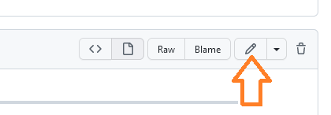
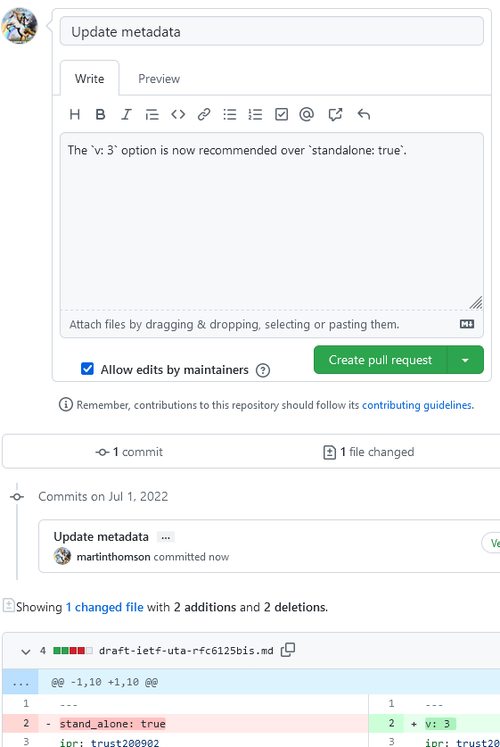
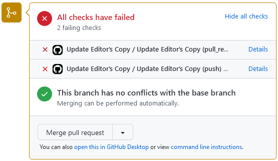
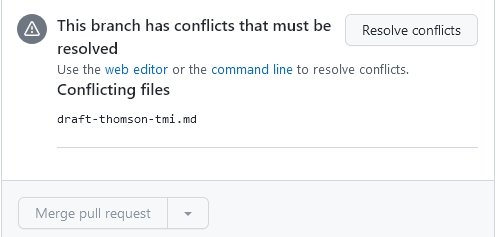

# Using GitHub's Web Interface

You can use GitHub's Web Interface to accomplish most editing tasks.  This is
not always as efficient as the command line.

To make a change, you [create a pull request](#create), [review it](#review),
and [merge it](#merge).

This page walks through that process in some detail, in case you aren't familiar
with the process.  It also covers some [troubleshooting practices](#busted).

If you are looking for how to submit a draft using the GitHub UI, see [the
instructions for draft submission](SUBMITTING.md#github-release).


## Creating Pull Requests
<a id=create>

This is the preferred method for managing the content of files, especially when
you are working with others.

Navigate to the draft you want to edit by first going to the
repository (`https://github.com/_$user_/_$repo_`) and selecting the draft
(`https://github.com/_$user_/_$repo_/blob/main/draft-_$name_.md`).

You will see, in the upper right, an edit button, often presented with a pencil
(✏️) icon:



If you don't have edit access to the repository, GitHub will automatically
create a copy of the repository in your personal space if you don't have one
already.  This allows you to make changes (or commits) without affecting the
main or authoritative copy.

Make your changes.

At the bottom of that page, there is a form where you commit your changes.
Enter some notes about the changes you made.

If you have commit access, then you will be presented with an option to create a branch:


Choose this option and maybe select a helpful name for the branch.

If you don't have commit access, then this option does not appear.  GitHub will
always create a branch for you.  These are named `patch-1`, `patch-2`, etc...,
which isn't very descriptive, but that doesn't matter.

Hit the "Propose changes" button.

If you don't have commit access, this first shows a page where it summarizes
your changes, with the following message:


Just hit the "Create pull request" button and move to the next step.

From here, you will have a form where you can create a pull request.  The form
will be pre-filled with any comments you already added.  Below this form will be
a view of the changes you made.



Review your comments and your changes, then hit the "Create pull request"
button.

The [GitHub
documentation](https://docs.github.com/en/pull-requests/collaborating-with-pull-requests/proposing-changes-to-your-work-with-pull-requests/creating-a-pull-request)
contains more information on creating pull requests.

Creating a pull request


## Reviewing Pull Requests
<a id=review>

Editors of documents (those with commit access to the repository) can review and
merge pull requests.  Simply go to the pull requests on the repository
(`https://github.com/_$user_/_$repo_`/pulls) and select the pull request.  This
will initially present a page that shows the summary provided by the author of
the pull request and any discussion that has occurred.

Here you can add new comments, but the most useful information is what changes
are made.  To see these, look for the "Files changed" tab, shown here:


Select this and you will see all the details of the files that have changed.
From this page, you can enter a review.

Leave comments on specific lines by selecting a change.  You can click on the
"+" icon that appears when you hover over each line to add a comment on that
line.


You can also dragging the mouse to select more than one line.

Add comments on any changes, then select the "Review changes" button (near the
top) where you can add some general comments about the changes and choose
between "Comment", "Approve" or "Request changes".


Anyone can review a pull request this way, but reviews from editors that
"Approve" or "Request changes" will be displayed differently by GitHub.


## Updating Pull Requests

During review, people might ask for small changes.

This can be in the form of suggestions.  This is a great feature, please [read
about
it](https://docs.github.com/en/pull-requests/collaborating-with-pull-requests/reviewing-changes-in-pull-requests/incorporating-feedback-in-your-pull-request#applying-a-suggested-change)
and use it.  Authors of pull requests and (usually) editors of documents can
accept suggestions through the GitHub UI.

If comments require changes that aren't in the form of suggestions, you can edit
the file by navigating to the "Files changed" tab and hitting the ellipsis
button for the changed file.


You will then be presented with the same edit interface.

After making changes to a pull request, do not create a new branch for the
changes, just commit directly to the branch.


Use the "Commit changes" button to confirm any changes.


## Merging Pull Requests
<a id=merge>

Once a pull request is ready, it can be merged by an editor by hitting the
"Merge pull request" button.


Then hit the "Confirm merge" button.


## Dealing with Problems
<a id=busted>

Sometimes this process doesn't go smoothly.


### Broken Builds

The previous examples showed a good change.  Occasionally, changes will result
in breaking the draft build.  Maybe the change included a missing reference.
This will show in the interface with a big X mark, something like this:



This pull request should not be merged until the build problem is fixed.


### Merge Conflicts

Sometimes two pull requests affect the same part of a file.  If one is merged,
GitHub might be unable to merge the other.  GitHub will offer the option to
"Resolve conflicts" as follows:



This leads to a page where you can edit the affected files.  This is similar to
the editing interface, but the conflicting lines of the file will be highlighted.

Control options are shown at the top, with the number of conflicts found, and
buttons that let you jump between them.


The conflict will be displayed inline in the document, something like this:

```
<<<<<<< your-branch-name
lines
from
your
change
=======
lines
from
the
main
branch
>>>>>>> main
```

Replace all of this with the content you wish to include for each conflict.  Use
the "Prev" and "Next" buttons to quickly find multiple conflicts.

Usually this means understanding what has happened to make the two sets of lines
diverge, which can be tricky, so take some care.

Once you are done, hit the "Mark as resolved" button, then "Commit merge".


### Reverting Pull Requests

If a bad pull request is merged, perhaps because it makes the draft no longer
build correctly, it can be reverted.


This opens a page where you can create a pull request that reverses the changes.
Create, review, and merge this pull request as normal.


## Linking to Issues

Any pull request can be linked to one or more issues.  When the pull request is
merged, those issues will be automatically closed.  This feature allows for
better tracking of the resolution of issues, as the change can then be traced to
the issue and the resolution can be traced from the issue.

By adding "closes #101" or "fixes #42" to the commit message or description of a
pull request, the link is created automatically.  Usually, this instruction is
put on a separate line so it is easy to notice; if a pull request closes
multiple issues, list each issue on a new line.

The "Development" option shown on the right hand side of an issue or pull
request page can be used to link issues and pull requests.  This can be used in
case the comments do not include the "Closes" or "Fixes" text.

Tip: A pull request can be linked to another pull request.  For example, if two
alternatives solutions are proposed, each might link to the other.  When one is
merged, the other is then closed.


## YOLO

Editors of a document (those with commit access to the repository) can edit
files directly.  From the page where you make changes, the option to "Commit
directly to the `main` branch" will be selected **by default**.


Leave this option selected, then hit the "Commit changes" button.  This will
make the changes directly to the document.

Avoid this approach if you are working with other people, even if you are sole
editor for a working group document.  Also avoid doing this if you don't like
dealing with a document that is broken.
